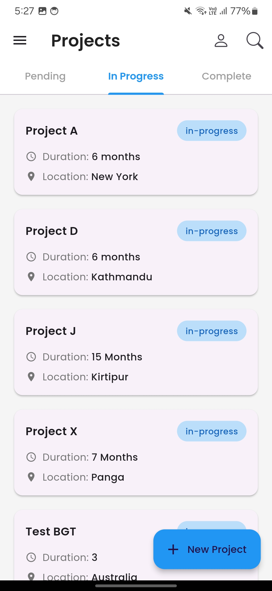
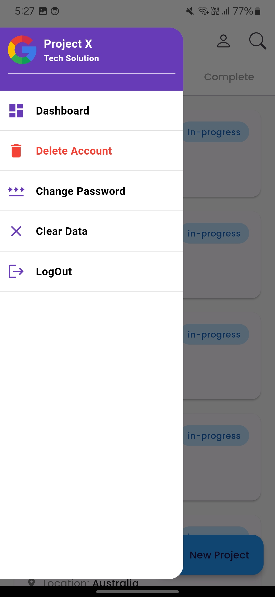
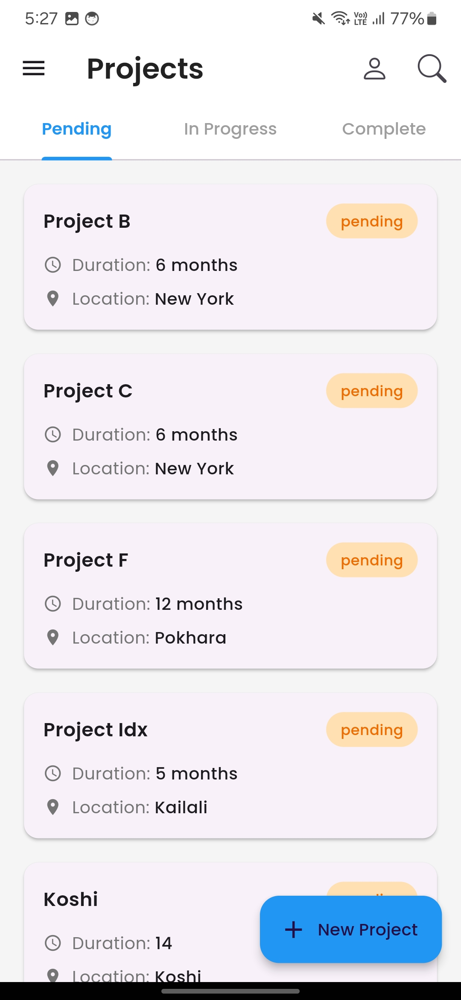
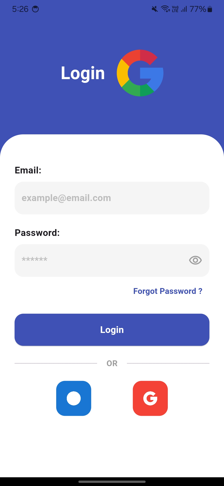
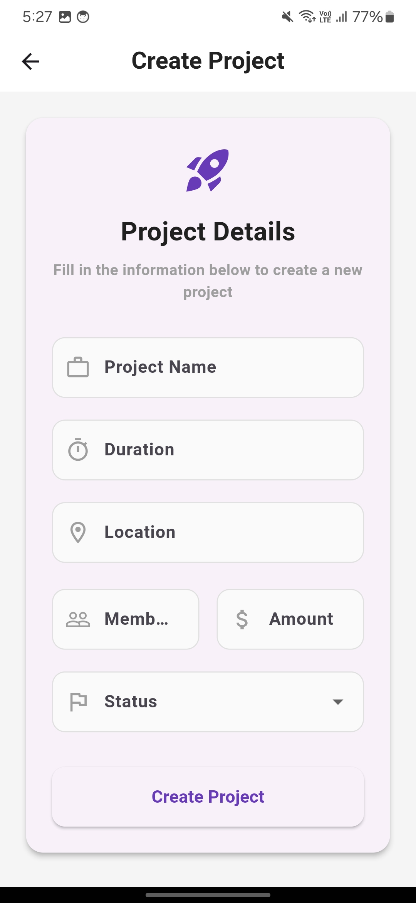
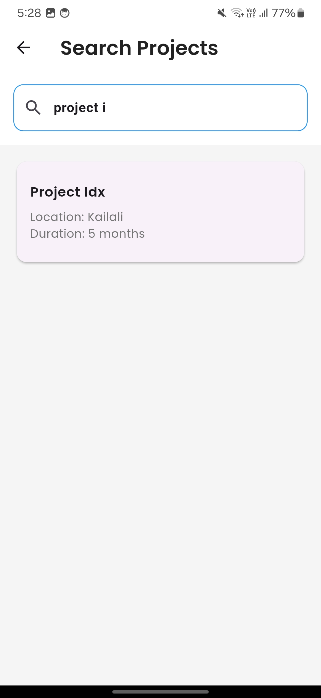

# Flutter Node.js BLoC Project

This project is a **Flutter** application built with **Node.js** as the backend, utilizing **BLoC (Business Logic Component)** state management for the frontend. The app communicates with the Node.js server for dynamic data handling and state management.

## Project Overview

- **Frontend**: Flutter app using BLoC for state management.
- **Backend**: Node.js REST API server to provide data to the Flutter app.
- **State Management**: BLoC for managing app states.

## Getting Started

Follow these steps to set up the project on your local machine.

### Prerequisites

- Flutter (latest stable version)
- Dart SDK
- Node.js (latest version)
- npm (Node package manager)

### Some of the image of the ui








### Setup the Backend (Node.js)

1. Clone the repository:
    ```bash
    git clone https://github.com/your-username/flutter-nodejs-bloc.git
    cd flutter-nodejs-bloc/backend
    ```

2. Install backend dependencies:
    ```bash
    npm install
    ```

3. Start the Node.js server:
    ```bash
    npm start
    ```

   The backend will start running on `http://localhost:3000`. You can modify the port in the `server.js` file if needed.

### Setup the Frontend (Flutter)

1. Go back to the root directory:
    ```bash
    cd ../frontend
    ```

2. Install Flutter dependencies:
    ```bash
    flutter pub get
    ```

3. Start the Flutter app:
    ```bash
    flutter run
    ```

   The Flutter app will run on your preferred device or emulator. It will communicate with the Node.js backend for real-time data updates.

## BLoC State Management

This project uses **BLoC** (Business Logic Component) to manage the state of the Flutter app. The main BLoC files are located in the `lib/bloc` directory, where different events trigger various states in the application.

### Example of BLoC Usage

In this project, you can find BLoC implementations like:

- `CounterBloc`: A simple BLoC that manages the state of a counter in the app.
- `ApiBloc`: Fetches data from the Node.js backend and manages the state of API responses.

The BLoC architecture is designed to make the app's state more predictable and maintainable.

## Project Structure

- `frontend/`: Contains all the Flutter code for the frontend.
    - `lib/`: Main Flutter code directory.
    - `lib/bloc/`: Contains all BLoC logic (events, states, and bloc).
    - `lib/screens/`: Contains different UI screens of the app.

- `backend/`: Contains the Node.js backend code.
    - `server.js`: Main Node.js server file.
    - `routes/`: Contains all the API routes.

## Testing the Project

### Flutter Tests

To run tests for the Flutter app:
```bash
flutter test
